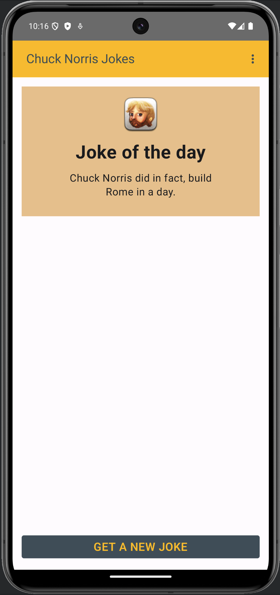

# Creating an Android App based on own topic

Create a mobile app based on your own idea/topic.
App could be displaying data retrieved from API service, or it could perform some calculation other software logic.
As mentioned, you can make the app based on your OWN topic and app does not have to include all the features that are implemented on the example app.

## My Idea

I decided to create an app that displays random Chuck Norris jokes.
The app uses the [Chuck Norris API](https://api.chucknorris.io/) to get the jokes.

The app has two screens: main and info. Main screen is where the user can see a joke and a button to get a new joke. It uses Retrofit to fetch the icon and joke data from the API and displays them on the main screen. Info screen has information about the app.

The app uses MVVM architecture and ViewModel class to hold the state and functionality for UI (composables).
The UI is simple and suitable for a mobile app. The theme is modified so the app does not use default values. 

All the strings are saved under strings.xml file. The app has navigation between the two screens. It uses API service and displays data retrieved from the service. The code is divided into separate files and packages.

Possible errors are handled, for example, if API does not return anything or there is an error, a message is displayed.
When data is loaded on the background, a spinner icon is displayed to the user on UI.
It also displays an image using Coil library (icon on the main screen).

## Requirements

App for grade 4 should have all features listed:
- App contains some software logic. It could be, for example, performing some calculation (complexity must be similar to Calories or Alcometer exercises) or retrieving (simple) data from API (like in Todos example). In case API has parameters, you can hardcode them (e.g., coordinate to weather API in case you choose the do the app based on example app)
- ViewModel class must be implemented for holding state and functionality for UI (composables)
- UI needs to suitable for mobile app. Modify theme (e.g., colors) so your app does not use default values.
- All the strings should be saved under resource file.
- Implement navigation and a simple screen (e.g., info screen). App must have at
  least two screens (main and info).

App for grade 5 should have all features listed for grade 4 and following:
- App must use API service and display data retrieved from the service.
- App must implement MVVM architecture.
- Code is divided into separate files and packages.
- Possible errors are handled (e.g., if API does not return anything or there is an error, a message is displayed).
- When data is loaded on the background, a message (or spinner) is displayed to the user on UI.
  App for grade 5 may contain also following features:
- Displaying an image (using Coil library).

## Implemented UI

